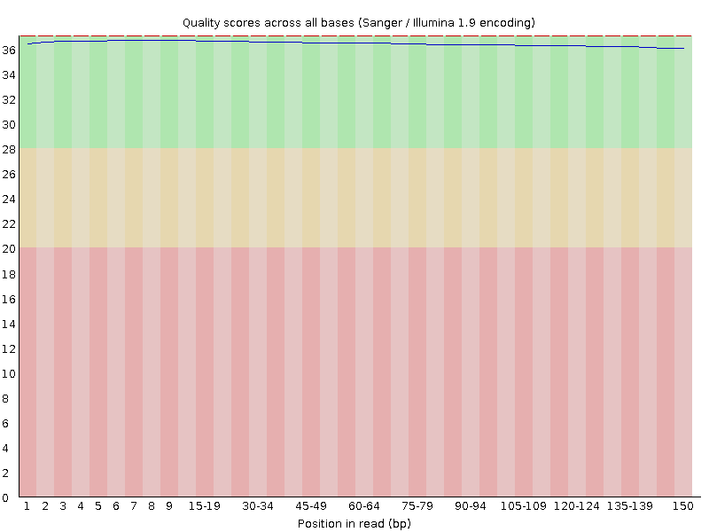
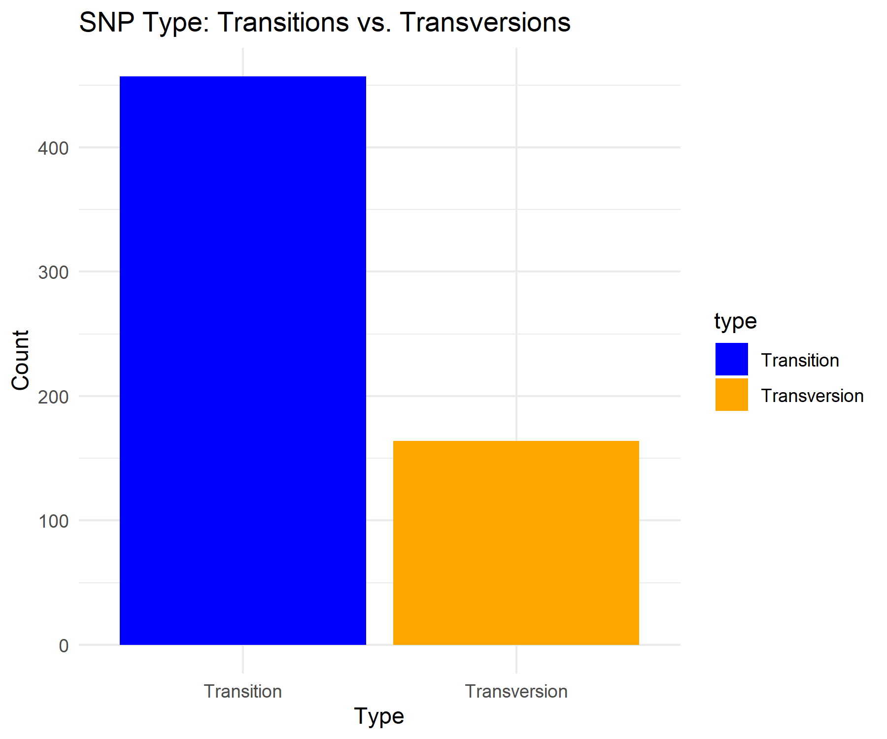
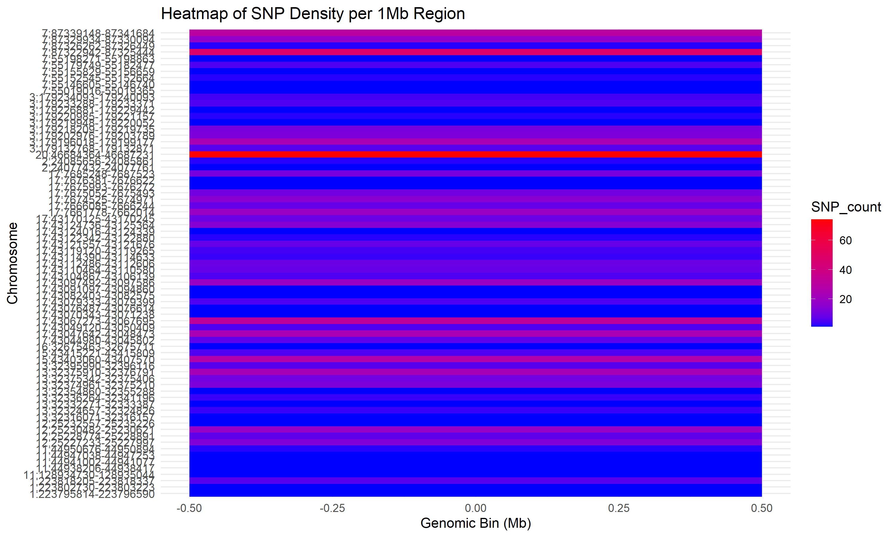

# Whole-Exome Sequencing Variant Analysis — Head and Neck Cancer

**Independent bioinformatics reanalysis by Syeda Hina Shah**

[](https://www.ncbi.nlm.nih.gov/sra/)
[](https://www.ncbi.nlm.nih.gov/sra/?term=SRR32633603)
[](LICENSE)

This repository presents an independent reanalysis of publicly available sequencing reads from **NCBI Sequence Read Archive run `SRR32633603`**. It documents read quality assessment, read preprocessing, alignment and SAM/BAM processing, GATK variant calling and hard filtering, and downstream analysis in R and Python.

> **Purpose:** "This repository demonstrates a reproducible computational workflow for whole-exome sequencing variant analysis using publicly available sequencing data."
## Dataset and attribution

- **Source repository:** NCBI Sequence Read Archive (SRA)
- **Run accession:** `SRR32633603`
- **Input:** paired-end sequencing reads
- **Project context:** head and neck cancer WES reanalysis
- **Analysis type:** independent secondary computational analysis

The original sequencing data were generated and deposited by the investigators associated with the NCBI record. I did **not** generate the raw sequencing data. I independently downloaded, processed, analysed, visualized, interpreted, and documented the dataset.

See [`DATASET.md`](DATASET.md) for data access and attribution details.

## My contribution

I independently performed and documented the computational workflow:

1. Downloaded the public SRA run.
2. Assessed paired-end reads using FastQC.
3. Performed adapter and quality trimming using fastp.
4. Aligned reads to the project reference using BWA.
5. Processed, sorted, indexed, and quality-checked SAM/BAM files using SAMtools and Picard-compatible steps.
6. Called variants using GATK HaplotypeCaller.
7. Selected SNPs and applied GATK hard filters.
8. Analysed the VCF using R/Bioconductor and Python.
9. Produced summary tables, scientific figures, and reproducibility documentation.

The exact GATK commands and versions retained in the VCF header are provided in [`workflow/gatk_provenance_from_vcf_header.txt`](workflow/gatk_provenance_from_vcf_header.txt). Earlier preprocessing commands were not preserved in the supplied history, so [`workflow/full_pipeline_template.sh`](workflow/full_pipeline_template.sh) is explicitly labelled as a reproducibility template rather than an exact execution log.


## Representative workflow metrics
The following aggregate metrics are provided solely to demonstrate successful pipeline execution and quality-control reporting. They are not presented as biological discoveries, disease-associated findings, or clinically interpretable results.
## Computational tools

- Quality control: FastQC, MultiQC
- Read preprocessing: fastp
- Alignment: BWA-MEM
- BAM processing: SAMtools, Picard
- Variant calling: GATK HaplotypeCaller
- Variant filtering: GATK VariantFiltration
- Statistical analysis and visualization: R, Python
- Reproducibility: GitHub documentation
  
## Project highlights

| Area | Evidence in this repository |
|---|---|
| Public dataset | NCBI SRA run `SRR32633603` |
| Sequencing quality control | Selected FastQC summaries and paired-read quality plots |
| Read preprocessing | fastp stage documented in the workflow |
| Alignment and BAM processing | BWA, SAMtools, and read-group processing documented |
| Variant calling provenance | GATK commands and version metadata retained from VCF headers |
| Variant filtering | GATK hard filtering using QD below 2.0, FS above 60.0, or MQ below 40.0 |
| Reproducible downstream analysis | Clean R/Bioconductor and Python scripts |
| Scientific communication | Methods, results, limitations, and reproducibility documentation |

| Metric | Result |
|---|---:|
| Sequences per paired read file | 26,740,039 |
| Read length | 150 bp |
| GC content | 51% for each read file |
| Raw GATK variant records | 751 |
| Filtered SNP records | 621 |
| PASS SNPs | 330 |
| Filtered-out SNPs | 291 |
| PASS rate | 53.1% |
| Median QUAL in filtered SNP set | 166.14 |
| Maximum QUAL | 10,192.06 |
| Transitions / transversions / other | 455 / 151 / 15 |

## Workflow

```text
NCBI SRA: SRR32633603
        ↓
SRA Toolkit download and paired FASTQ generation
        ↓
FastQC raw-read quality assessment
        ↓
fastp adapter and quality trimming
        ↓
BWA alignment to the project reference
        ↓
SAMtools sorting/indexing + read-group processing
        ↓
GATK HaplotypeCaller
        ↓
GATK SelectVariants + VariantFiltration
        ↓
R/Bioconductor + Python downstream analysis
        ↓
Metrics, figures, documentation, and GitHub Pages site
```
## Featured outputs

### Sequencing quality



### Variant quality distribution


### Transition/transversion profile



### Regional SNP density



## Reproduce the included downstream analysis

### Python

```bash
python scripts/analysis/vcf_summary.py /path/to/filtered_snps.vcf \
  --output results/generated/filtered_snps_summary.json
```

### R/Bioconductor

```bash
Rscript scripts/analysis/wes_snp_analysis.R \
  /path/to/filtered_snps.vcf results/generated
```

Or run both:

```bash
bash scripts/analysis/run_analysis.sh /path/to/filtered_snps.vcf results/generated
```

Sample-level VCF/GDS files are intentionally not included in this slim public portfolio. Regenerate the VCF from `SRR32633603` with the documented workflow, then supply its path to the scripts. Environment guidance is in [`scripts/setup/`](scripts/setup/) and [`docs/reproducibility.md`](docs/reproducibility.md).

## Interpretation and limitations

These results should not be interpreted as evidence of clinical pathogenicity, disease association, population-level significance, or treatment relevance. The repository is intended to demonstrate a reproducible bioinformatics workflow using publicly available data rather than to present novel biological or clinical findings.

Only curated scripts, aggregate results, and final figures are included in this public repository. These results should not be interpreted as evidence of clinical pathogenicity, disease association, population-level significance, or treatment relevance must not be presented as biological evidence from this single-sample VCF.

## Citation and licensing

Please cite the original NCBI dataset/study and this repository when reusing the workflow or figures. Code and original repository documentation are released under the MIT License. Sequencing data, derived genomic data, FastQC assets, and third-party materials remain subject to their original data-use conditions. Citation metadata is provided in [`CITATION.cff`](CITATION.cff).
