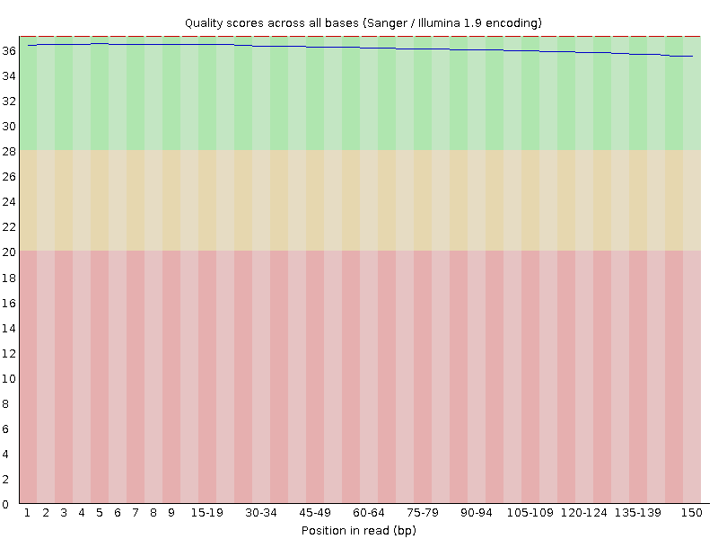
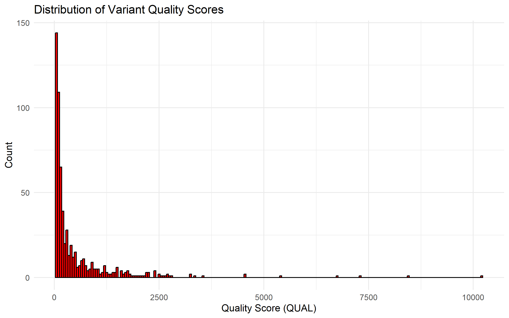

# Whole-Exome Sequencing Variant Analysis

## Syeda Hina Shah — Bioinformatics Research Portfolio

This portfolio presents an independent reanalysis of public NCBI SRA run **`SRR32633603`** and demonstrates experience in Linux-based sequencing workflows, FastQC, fastp, BWA, SAMtools, GATK, VCF analysis, R/Bioconductor, Python, visualization, reproducibility, and scientific communication.

## Project at a glance

- **Public data source:** NCBI SRA `SRR32633603`
- **26,740,039 sequences** per paired FASTQ file
- **150 bp** read length and **51% GC**
- **751** raw GATK variant records
- **621** filtered SNP records
- **330** PASS SNPs
- **53.1%** PASS rate
- **455 transitions**, **151 transversions**, and **15 other allele patterns**

## Quality-control evidence

### Read 1

### Read 2

## Variant-analysis evidence

### QUAL distribution

### Transition/transversion profile

### Regional SNP density

## Skills demonstrated

- NCBI SRA data acquisition
- Linux/WSL bioinformatics environment
- FastQC interpretation and fastp preprocessing
- BWA alignment and SAMtools BAM processing
- GATK HaplotypeCaller, SelectVariants, and VariantFiltration
- VCF parsing and quality assessment
- R/Bioconductor with VariantAnnotation
- Python scripting and JSON summaries
- ggplot2 visualization
- research documentation and presentation design

## Download project materials

- [Research portfolio PDF](downloads/WES_HNC_Research_Portfolio.pdf)
- [Professor presentation PPTX](downloads/WES_HNC_Professor_Presentation.pptx)

## Research direction

I am seeking fully funded graduate or research opportunities in bioinformatics, cancer genomics, computational biology, precision medicine, and translational genomics. I am especially interested in reproducible pipelines, cohort-scale analysis, functional annotation, statistical genetics, and clinically meaningful interpretation.
